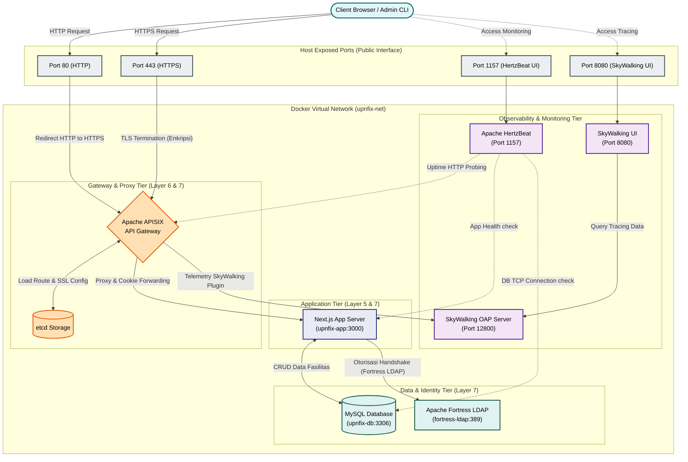

### 3.5 Diagram Arsitektur Jaringan (Deployment)

Dokumen ini memvisualisasikan diagram arsitektur deployment sistem UPNFIX yang terisolasi di dalam jaringan virtual kontainer Docker (`upnfix-net`) menggunakan tumpukan teknologi keamanan Apache Software Foundation.

---

### Penjelasan Komponen Arsitektur:
1. **Host Exposed Ports (Interface Publik):**
   * Pintu masuk utama lalu lintas data bagi pengguna. Lalu lintas HTTP (Port 80) dialihkan ke HTTPS (Port 443) demi keamanan data.
   * Port `1157` dan `8080` diekspos ke host agar Administrator sistem dapat memantau status monitoring (HertzBeat) dan grafik distributed tracing (SkyWalking).
2. **Gateway Tier (Apache APISIX):**
   * Berfungsi sebagai *reverse proxy* di tepi jaringan (*edge*). APISIX melakukan enkripsi/dekripsi HTTPS (*TLS Termination*) dan menerapkan pembatasan laju (*Rate Limiting*) sebelum request menyentuh Next.js.
3. **Application Tier (Next.js):**
   * Menjalankan logika bisnis aplikasi dan memvalidasi cookie sesi JWT (Layer 5 Session).
4. **Data & Identity Tier:**
   * MySQL menyimpan data relasional dummy secara aman.
   * Apache Fortress LDAP memusatkan hak akses (*decoupled authorization*).
5. **Observability & Monitoring Tier:**
   * HertzBeat secara berkala mengirimkan probe sintetik untuk memastikan ketersediaan server.
   * SkyWalking menerima data trace dari *APISIX telemetry plugin* guna mendeteksi anomali jaringan.
